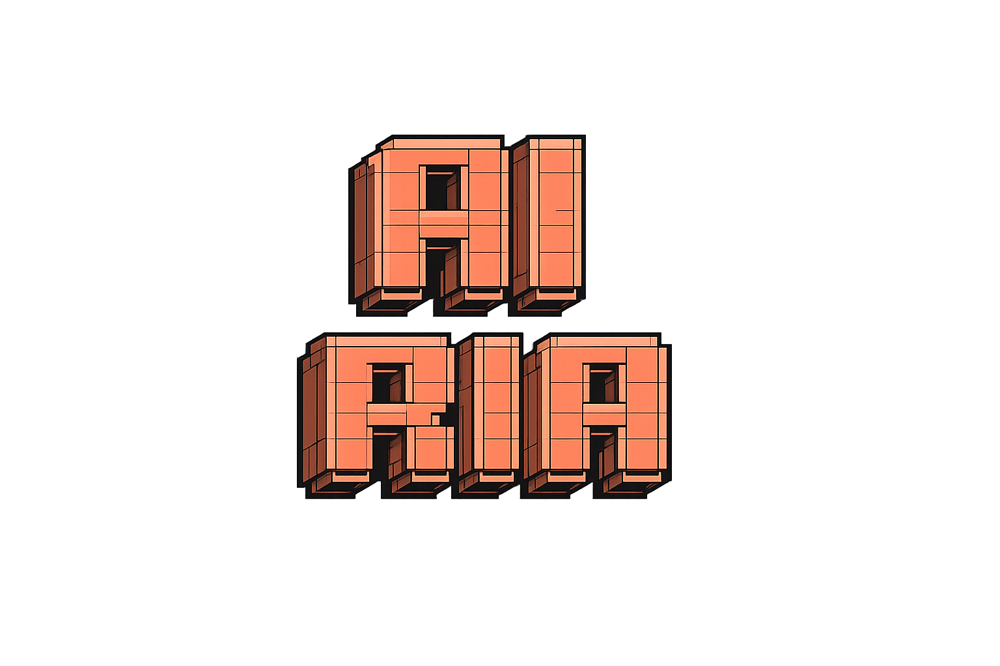
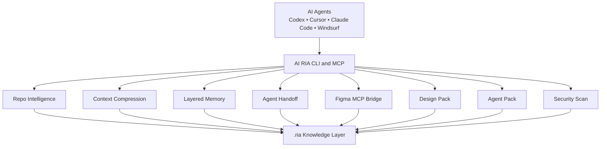

# AI RIA

<div align="center">
  

  <p><strong>Runtime Intelligence for AI Agents</strong></p>
  <p>
    A shared intelligence layer for AI coding agents with
    <strong>Context Compression</strong>,
    <strong>Layered Memory</strong>,
    <strong>Agent Handoff</strong>,
    <strong>Agent Pack</strong>,
    <strong>Figma MCP Bridge</strong>,
    <strong>Design Pack</strong>, and
    <strong>Security Intelligence</strong>.
  </p>

  <p>
    <a href="./docs/Vision.md">Vision</a> •
    <a href="./docs/Architecture.md">Architecture</a> •
    <a href="./docs/Roadmap.md">Roadmap</a> •
    <a href="./ai-ria/README.md">CLI Docs</a>
  </p>
</div>

---

<div align="center">
  <h2>Agent Intelligence Layer</h2>
  <p>
    <strong>AI RIA is not another coding agent.</strong><br />
    It prepares compressed project context, persistent memory, handoff state,
    and design knowledge so the next agent can start fast and work consistently.
  </p>
</div>

## What It Is

AI RIA is a CLI-first intelligence layer for multi-agent software workflows. It turns repositories, design signals, and prior agent work into reusable `.ria/` artifacts that save tokens and reduce repeated analysis.

The goal is simple:

| Need | AI RIA Output |
| --- | --- |
| Next-agent startup | `.ria/agent-pack/AGENT_PACK.md` |
| Cheap repo context | `.ria/context-pack.md` |
| Daily memory | `.ria/memory/short-memory.md` |
| Active-task memory | `.ria/memory/working-memory.md` |
| Deep project history | `.ria/memory/deep-memory.md` |
| Structured handoff | `.ria/handoffs/latest.json` + `.ria/handoffs/HANDOFF.md` |
| Visual/design transfer | `.ria/design/DESIGN_PACK.md` |
| Token-aware reporting | `.ria/context/token-report.json` |

## Core Capabilities

| Capability | What it does |
| --- | --- |
| Context Compression | Converts large repositories into token-cheap context packs |
| Layered Memory | Splits memory into short, working, and deep levels |
| Conversation Compression | Distills long agent conversations into decisions, tasks, warnings, and next actions |
| Agent Handoff | Creates a structured handoff another agent can resume from |
| Agent Pack | Produces the main compressed file another agent should read before editing |
| Figma MCP Bridge | Supports tokenless Figma/plugin/MCP exports as design input |
| Design Pack | Converts visual knowledge into compact Markdown for implementation agents |
| Security Intelligence | Surfaces risky files, secrets, unsafe commands, and policy issues |

## Architecture



## Installation

AI RIA currently ships as a Node.js CLI in [`ai-ria`](./ai-ria/README.md).

| Requirement | Version |
| --- | --- |
| Node.js | `>=20` |
| npm / pnpm | Modern version |

```bash
cd ai-ria
npm install
npm run build
```

Run locally without global install:

```bash
node .\node_modules\tsx\dist\cli.mjs .\src\cli\index.ts --help
```

## Main Workflow

This is the current intended agent workflow:

```bash
cd ai-ria

npm run ria -- analyze ./my-project
npm run ria -- context build ./my-project
npm run ria -- memory add ./my-project --task "Refactor header" --decision "Keep shared layout" --reason "Avoid duplication"
npm run ria -- memory compress-conversation ./my-project ./conversation.txt
npm run ria -- handoff create ./my-project --task "Refactor header" --completed "Navbar cleanup" --remaining "Responsive pass"
npm run ria -- design-pack ./my-project
npm run ria -- agent-pack ./my-project
```

The next agent should normally start with:

```text
.ria/agent-pack/AGENT_PACK.md
```

If it needs more memory:

```text
.ria/memory/working-memory.md
.ria/memory/deep-memory.md
```

## CLI Surface

| Goal | Command |
| --- | --- |
| Full repo intelligence | `ria analyze <project>` |
| Build compressed context | `ria context build <project>` |
| Save memory entry | `ria memory add <project> --task ... --decision ...` |
| Compress a conversation | `ria memory compress-conversation <project> <conversation-file>` |
| Generate short memory | `ria memory short <project>` |
| Generate working memory | `ria memory working <project>` |
| Generate deep memory | `ria memory deep <project>` |
| Create handoff | `ria handoff create <project> ...` |
| Build design pack | `ria design-pack <project>` |
| Build agent pack | `ria agent-pack <project>` |
| Run security scan | `ria security <project>` |

## Tokenless Figma Workflow

AI RIA can now work without a Figma API token if you provide plugin/MCP-exported JSON.

Supported sources:

| Source | Token required |
| --- | --- |
| Figma API via `figma extract --file` | Yes |
| Local Figma export JSON | No |
| Figma token JSON | No |
| `cursor-talk-to-figma-mcp` wrapped output | No |

### Tokenless import

```bash
node .\node_modules\tsx\dist\cli.mjs .\