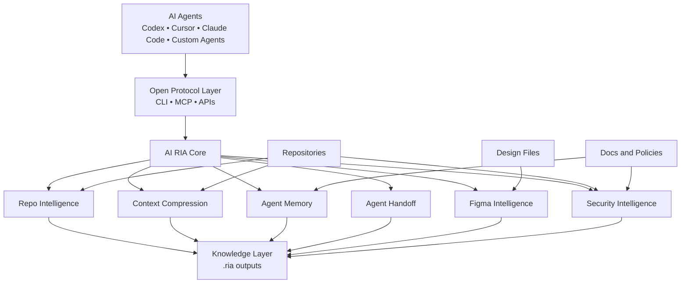

# AI RIA

<div align="center">
  

  <h1>AI RIA</h1>
  <p><strong>Runtime Intelligence for AI Agents</strong></p>
  <p>
    Open-source infrastructure that gives AI coding agents
    <strong>Context Compression</strong>,
    <strong>Agent Memory</strong>,
    <strong>Agent Handoff</strong>,
    <strong>Figma Intelligence</strong>,
    <strong>Repo Intelligence</strong>, and
    <strong>Security Intelligence</strong>.
  </p>

  <p>
    <a href="./docs/Vision.md">Vision</a> •
    <a href="./docs/Architecture.md">Architecture</a> •
    <a href="./docs/Roadmap.md">Roadmap</a> •
    <a href="./ai-ria/README.md">CLI Docs</a>
  </p>
</div>

---

<div align="center">
  <h2>🚀 GitHub-Style Hero</h2>
  <p>
    <strong>AI RIA is not another agent.</strong><br />
    It is the intelligence layer between agents and the repositories they work on.
  </p>
</div>

AI agents are fast, but they still waste tokens re-reading code, lose decisions between sessions, drift from design systems, and hand work off poorly. AI RIA solves that at the infrastructure level by generating a persistent `.ria/` knowledge layer any agent can consume.

## ✨ What AI RIA Does

| Capability | What it means in practice |
| --- | --- |
| 🗜️ Context Compression | Turns large repos into token-cheap context packs agents can actually afford |
| 🧠 Agent Memory | Stores decisions, rules, warnings, and design knowledge across sessions |
| 🤝 Agent Handoff | Produces structured handoff files so one agent can resume another agent's work without loss |
| 🎨 Figma Intelligence | Connects design files to code, tokens, components, and UI consistency checks |
| 🗂️ Repo Intelligence | Builds architecture, feature, route, component, and convention awareness from the repo itself |
| 🔐 Security Intelligence | Scans for secrets, risky patterns, unsafe commands, and agent-generated security issues |

## 📌 Short Project Description

AI RIA is an open-source CLI and MCP-ready intelligence layer for AI coding workflows. It analyzes a repository, compresses its working context, preserves cross-agent memory, bridges design-to-code with Figma-aware outputs, and produces security-aware agent guidance inside a portable `.ria/` folder.

## 🧭 Why It Exists

| Problem | AI RIA Response |
| --- | --- |
| Agents repeatedly burn tokens on the same repo | Generate compressed context once and reuse it |
| Sessions forget architecture decisions | Save durable project memory and searchable decisions |
| Multi-agent work creates duplicate effort | Use shared memory plus structured handoffs |
| Generated UI drifts from design systems | Build design memory and compare code against Figma |
| Agent output can introduce risk | Run security scanning before changes land |

## 🏗️ Architecture



### Core Flow

| Layer | Responsibility |
| --- | --- |
| Agent Layer | Any coding agent can consume the outputs |
| Protocol Layer | CLI and MCP expose RIA capabilities without vendor lock-in |
| Intelligence Modules | Repo, compression, memory, handoff, Figma, and security modules do the heavy lifting |
| Knowledge Layer | All generated outputs land in `.ria/` for reuse by any agent |

## 🛠️ Installation

AI RIA currently ships as a Node.js CLI inside [`ai-ria`](./ai-ria/README.md).

### Requirements

| Tool | Version |
| --- | --- |
| Node.js | `>=20` |
| npm / pnpm | Any modern version |

### Setup

```bash
cd ai-ria
npm install
npm run build
```

### Run Without Global Install

```bash
npm run ria -- analyze ./examples/demo-app
```

### Optional: Local CLI Shortcut

```bash
npx tsx src/cli/index.ts --help
```

## 💻 CLI Usage Examples

### Quick Start

```bash
cd ai-ria
npm install
npm run build

# Generate the complete intelligence layer for a repo
npm run ria -- analyze ./examples/demo-app
```

### Common Commands

| Goal | Command | Output |
| --- | --- | --- |
| Scan a repo | `npm run ria -- scan ./my-app` | `.ria/repo-map.json`, `.ria/repo-summary.md` |
| Generate full intelligence pack | `npm run ria -- analyze ./my-app` | Full `.ria/` knowledge folder |
| Compress context | `npm run ria -- compress ./my-app` | `.ria/context-pack.md`, `.ria/context-pack.json` |
| Generate design knowledge | `npm run ria -- design ./my-app` | `.ria/DESIGN.md` |
| Run security scan | `npm run ria -- security ./my-app` | `.ria/SECURITY_REPORT.md`, `.ria/security-report.json` |
| Save project memory | `npm run ria -- memory save ./my-app --task "Navbar refactor" --decision "Moved navbar to shared layout"` | `.ria/memory/*.json` |
| Create handoff | `npm run ria -- handoff create ./my-app --task "Checkout improvements"` | `.ria/handoffs/latest.json` |
| Start MCP server | `npm run ria -- mcp` | MCP server over stdio |

### Figma Workflow

```bash
# Verify token
npm run ria -- figma connect

# Extract from a local export
npm run ria -- figma extract ./my-app --from ./examples/figma-export.json

# Compare design tokens against code
npm run ria -- figma compare ./my-app
```

## 🧪 ChemService Example

The following is a realistic workflow for a repository such as `chemservice-portal`, where multiple agents work on regulated product catalog, ordering, and compliance UI flows.

### 1. Analyze the repository

```bash
cd ai-ria
npm run ria -- analyze ../chemservice-portal
```

### 2. Save a team decision into shared memory

```bash
npm run ria -- memory save ../chemservice-portal \
  --task "SDS document experience" \
  --decision "Keep safety document links inside product detail pages" \
  --reason "Compliance and support teams require a stable, user-visible location" \
  --type decision \
  --files "src/pages/products/[id].tsx,src/components/SdsPanel.tsx" \
  --tags "compliance,product-detail,chemservice" \
  --agent codex
```

### 3. Hand off work to another agent

```bash
npm run ria -- handoff create ../chemservice-portal \
  --task "Improve hazardous material checkout flow" \
  --completed "Product detail warnings, compliance banner" \
  --remaining "Shipping restrictions, checkout validation, audit copy review" \
  --warnings "Do not modify payment provider integration without review" \
  --agent codex
```

### 4. Run security checks before merging

```bash
npm run ria -- security ../chemservice-portal
```

### What the next agent gets

| File | Why it matters |
| --- | --- |
| `.ria/AGENT_CONTEXT.md` | Fast onboarding context |
| `.ria/ARCHITECTURE.md` | Repo structure and important modules |
| `.ria/DESIGN.md` | Design rules and token awareness |
| `.ria/memory-pack.md` | Compressed decision history |
| `.ria/handoffs/latest.json` | Exact task state for agent handoff |
| `.ria/SECURITY_REPORT.md` | Known risks and policy-sensitive areas |

## 📁 Generated `.ria/` Folder Example

Example structure based on the current CLI outputs:

```text
.ria/
├── AGENT_CONTEXT.md
├── AGENTS.md
├── ARCHITECTURE.md
├── DESIGN.md
├── FEATURES.md
├── SECURITY_REPORT.md
├── context-pack.json
├── context-pack.md
├── repo-map.json
├── repo-summary.md
├── security-report.json
├── summary.json
├── design-memory.json
├── memory-pack.md
├── memory/
│   ├── <entry>.json
│   └── ...
├── handoffs/
│   ├── latest.json
│   └── <handoff-id>.json
├── figma-tokens.json
├── figma-components.json
├── figma-design-summary.md
├── FIGMA_CODE_DIFF.md
├── UI_FIX_REPORT.md
└── ui-fix.patch
```

### Agent Prompt Pattern

```text
Before editing this project, read .ria/AGENT_CONTEXT.md, .ria/DESIGN.md,
and .ria/ARCHITECTURE.md. Follow .ria/AGENTS.md rules.
```

## 🗺️ Roadmap

| Version | Focus | Outcome |
| --- | --- | --- |
| `v0.1` | Repo Intelligence, Context Compression, Agent Memory, Agent Handoff | Persistent project knowledge with token-cheap context |
| `v0.2` | Design Intelligence, Figma Intelligence | Design-aware agents and code-to-design validation |
| `v0.3` | Security Intelligence, Skills Runtime | Safer agent workflows and reusable procedures |
| `v0.4` | Auto UI Fix, Multi-Agent Routing | Shared-state collaboration and guided autonomous execution |

See the full plan in [docs/Roadmap.md](./docs/Roadmap.md).

## 🤝 Contributing

Contributions are welcome. The most useful contributions right now are:

| Area | Examples |
| --- | --- |
| Core intelligence | Repo scanning, compression quality, token budgeting |
| Memory and handoff | Better schemas, search, ranking, continuity workflows |
| Design and Figma | Token extraction, component mapping, diff quality |
| Security | New detectors, policy models, safer defaults |
| Developer experience | CLI ergonomics, docs, examples, MCP integrations |

### Suggested Workflow

```bash
cd ai-ria
npm install
npm run build
npm test
```

### Contribution Guidelines

1. Open an issue or discussion for larger changes.
2. Keep changes focused and easy to review.
3. Add or update tests when behavior changes.
4. Update docs when commands, outputs, or workflows change.

## 📚 Project Docs

| Document | Purpose |
| --- | --- |
| [Vision](./docs/Vision.md) | Why AI RIA exists |
| [Architecture](./docs/Architecture.md) | High-level system design |
| [Roadmap](./docs/Roadmap.md) | Versioned execution plan |
| [CLI README](./ai-ria/README.md) | Package-level usage details |

## 📄 License

The CLI package in `ai-ria/` is licensed under `MIT`. The top-level project is being prepared for open-source release and should align to the same release posture.
