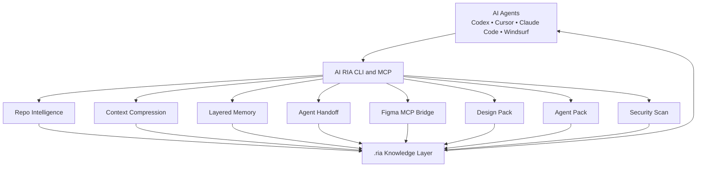

# AI RIA

<div align="center">
  

  <p><strong>Runtime Intelligence for AI Agents</strong></p>

  <p>
    <a href="https://github.com/maribostashvili-93/AI-ria-/actions/workflows/ci.yml"></a>
    = 20" />
    
    
  </p>

  <p>
    <a href="#quick-start">Quick start</a> •
    <a href="#what-it-does">What it does</a> •
    <a href="#command-reference">Commands</a> •
    <a href="./docs/Architecture.md">Architecture</a> •
    <a href="./docs/Roadmap.md">Roadmap</a>
  </p>
</div>

---

## The problem

Every AI coding agent starts from zero. It re-reads the repository, re-derives
the architecture, re-discovers the design system, and forgets every decision the
moment the session ends. Switch agents — Claude Code to Cursor, Cursor to Codex
— and you pay for all of it again.

**AI RIA is not another coding agent.** It is the layer underneath them: it
compresses a repository into a token-cheap knowledge folder, keeps memory across
sessions, and hands one agent's state to the next.

```
your-project/
└── .ria/                 ← the shared knowledge layer every agent reads
```

## What it does

| Capability | What you get |
| --- | --- |
| **Context compression** | A 2.6M-token repository becomes a ~12k-token pack that keeps the architecture, routes, components and conventions |
| **Layered memory** | Decisions, warnings and design rules survive across sessions — split into short, working and deep layers |
| **Agent handoff** | One agent stops, writes structured state; the next resumes without re-reading the repo |
| **Agent pack** | `AGENT_PACK.md` — the single file the next agent reads before editing |
| **Provider packs** | The same knowledge at each agent's token budget (Claude 12k, Cursor 8k, Codex 6k, compact 2.5k), always stating what was dropped |
| **Figma bridge** | Design tokens from the Figma API *or* from plugin/MCP exports with no token at all |
| **Security intelligence** | Secrets, unsafe commands, credentials in SQL migrations and connection URLs, prompt injection in agent-instruction files — report only, never executed |
| **Project inference** | Plans are derived from the repo — routes, components, design tokens, and the stack it already commits to — turned into rules, with the source of every part recorded |
| **Studio** | A local dashboard over `.ria/`: memory graph, routing, tokens, security, handoffs |

It reads framework projects (Next.js, Nuxt, Astro, Vue, Svelte, React) and plain
multi-page sites alike — for a site whose pages are `index.html`, `admin.html`
and `login.html`, those *are* the routes. Design tokens are read straight from
the stylesheets, minified or not, and `DESIGN.md` flags any token defined twice
with different values instead of silently picking one.

Everything is deterministic. **AI RIA makes no LLM calls** — no API key, no
inference cost, no non-reproducible output. It is static analysis plus
bookkeeping, and it runs in seconds.

## Quick start

Requires **Node.js ≥ 20**.

```bash
git clone https://github.com/maribostashvili-93/AI-ria-.git
cd AI-ria-/ai-ria
pnpm install
```

Point it at a project:

```bash
pnpm run ria -- analyze ./examples/demo-app
```

```text
Checklist:
  framework:          Next.js
  routes:             2
  components:         1
  styles:             2
  design tokens:      8
  security findings:  6 (4 critical/high)
  context pack:       ~525 tokens (raw ~620, ratio 0.8468)
```

*(The demo app ships intentional vulnerabilities so the scanner has something to
find. On a clean repository it reports nothing — see [Real examples](#real-examples)
for numbers from a 2,280-file project.)*

Then run the agent workflow on your own project:

```bash
pnpm run ria -- analyze ../my-project
pnpm run ria -- context build ../my-project
pnpm run ria -- memory add ../my-project --title "Keep the shared layout" --type decision
pnpm run ria -- handoff create ../my-project --task "Refactor header" --remaining "Responsive pass"
pnpm run ria -- agent-pack ../my-project
```

Now tell your agent:

```text
Read .ria/agent-pack/AGENT_PACK.md before editing anything.
```

If it needs more, `.ria/memory/working-memory.md` and
`.ria/memory/deep-memory.md` are next.

### One command for a whole goal

```bash
pnpm run ria -- orchestrate ../my-project --goal "Build the dashboard UI from Figma"
```

Plans the work, routes it across agents, and builds exactly the packs those
agents need:

```text
Plan: saas-dashboard | 6 pages, 11 components
Derived from: pages=template, components=repository + template,
              palette=project design tokens, security=repository evidence + template
Existing components to reuse: 43
Stack constraints: Express, Vitest, Playwright, Testing Library, Tailwind CSS, Zod
Routing: visual -> claude -> security -> compact
VISUAL_CONTEXT.md:   ~2930 tokens (budget 10000)
CLAUDE_CONTEXT.md:   ~2818 tokens (budget 12000)
SECURITY_CONTEXT.md: ~2980 tokens (budget 6000)
COMPACT_CONTEXT.md:  ~1933 tokens (budget 2500)
```

**The plan is read out of the repository, not guessed.** Routes become pages,
existing component files become components to reuse rather than rebuild, the
project's own CSS custom properties become the palette, and dependencies decide
which flows need a security review (`stripe` → payments, `next-auth` → sessions).

It also detects what the project already commits to and turns it into rules the
agent has to follow:

```text
Stack constraints detected (6):
  api           Express              dependency "express"
  testing       Vitest               dependency "vitest"
  testing       Playwright           dependency "@playwright/test"
  testing       Testing Library      dependency "@testing-library/jest-dom"
  styling       Tailwind CSS         dependency "tailwindcss"
  forms         Zod                  dependency "zod"
```

→ *"Style with Tailwind utility classes and the project's token scale — do not
add ad-hoc CSS files."* · *"Every user-facing string goes through next-intl
message files — never hardcode copy in a component."* · *"Validate with Zod
schemas, and validate on the server too — client validation is not a control."*

State, server-state, data, API, i18n, testing, styling, UI kit and forms are
covered. Dependencies are collected from nested manifests too, so monorepos work
— and fixtures never count as evidence. Every line of the plan records where it
came from, so it can be argued with.

### See it

```bash
pnpm run ria -- studio ../my-project
# AI RIA Studio running at http://localhost:3333
```

## Architecture



`ria analyze` walks the repository **once** and reuses that map for design
analysis, security scanning and compression.

## What `.ria/` contains

```text
.ria/
├── AGENT_CONTEXT.md          # what an agent needs to know first
├── ARCHITECTURE.md           # how the project is built
├── FEATURES.md · AGENTS.md · DESIGN.md
├── agent-pack/AGENT_PACK.md  # ← the file the next agent reads
├── context/                  # ranked, budgeted context pack + token report
├── exports/                  # CLAUDE_ · CURSOR_ · VISUAL_ · SECURITY_ · COMPACT_CONTEXT.md
├── memory/                   # short · working · deep · graph · conversation summary
├── handoffs/                 # latest.json + HANDOFF.md
├── design/DESIGN_PACK.md     # design knowledge for UI agents
├── figma/                    # imported tokens + summary
├── visual/                   # decision → component → Figma node → code chains
├── orchestration/            # agent routing + plan
├── tokens/                   # ledger, budgets, savings report
└── security-report.json · SECURITY_REPORT.md
```

## Command reference

| Goal | Command |
| --- | --- |
| Full repo intelligence | `ria analyze <project>` |
| Build compressed context | `ria context build <project> [--budget 12000]` |
| Save a memory | `ria memory add <project> --title "..." --type decision` |
| Compress a conversation | `ria memory compress-conversation <project> <file>` |
| Memory layers | `ria memory short\|working\|deep <project>` |
| Memory graph | `ria memory graph <project>` |
| Create / load handoff | `ria handoff create <project> --task "..."` · `ria handoff load <project>` |
| The next-agent file | `ria agent-pack <project>` |
| Provider pack | `ria pack claude\|cursor\|codex\|compact\|visual\|security <project>` |
| Design pack | `ria design-pack <project>` |
| Security scan | `ria security <project> [--fail-on high] [--include-fixtures]` |
| Orchestrate a goal | `ria orchestrate <project> --goal "..."` |
| Plan a new UI | `ria plan-ui <project> --goal "..."` |
| Figma → DESIGN.md | `ria figma import <project> <export.json>` · `ria figma to-design-md <project>` |
| Knowledge / design graph | `ria graph build <project>` · `ria visual memory <project>` |
| Token report | `ria tokens report <project>` |
| Studio dashboard | `ria studio <project> [--port 3333]` |
| MCP server | `ria mcp` |

Full per-command reference: [`ai-ria/README.md`](./ai-ria/README.md).

## Tokenless Figma workflow

No Figma API token needed if you can export JSON from a plugin or MCP bridge.

| Source | Token required |
| --- | --- |
| Figma API via `figma extract --file` | Yes |
| Local Figma export JSON | No |
| Figma token JSON (flat designer file) | No |
| `cursor-talk-to-figma-mcp` wrapped output | No |

```bash
ria figma import ./my-project ./figma-mcp-export.json
ria figma to-design-md ./my-project
ria agent-pack ./my-project
```

## Real examples

### A small multi-page app

`pitforge` — a 19-file Vite + Supabase SEO auditor whose pages are plain HTML
(last run 2026-07-30):

```bash
ria analyze "…/pitforge"
ria memory add "…/pitforge" --title "…" --type design-rule
ria handoff create "…/pitforge" --task "Improve the SEO audit dashboard UI"
ria orchestrate "…/pitforge" --goal "Improve the dashboard UI and harden the auth flow"
ria agent-pack "…/pitforge"
```

| Metric | Result |
| --- | --- |
| Files / lines | `19` / `4728` |
| Routes | `/`, `/admin`, `/login` — read from the HTML pages |
| Design tokens | `22`, plus one conflict flagged (`--line` differs across two stylesheets) |
| Security findings | `0` — `--fail-on high` exits `0`, so it can gate CI |
| Context pack | `~6340` tokens vs `~49279` raw (ratio `0.13`) |
| Plan sources | pages = repository routes · palette = project design tokens · stack = Supabase |
| `AGENT_PACK.md` | `~2556` tokens, 6 sections |
| `ria analyze` runtime | `~3.8s` |

A small project compresses less — there is less redundancy to remove — and the
plan leans on the repository rather than a template, which is the point.

### A large multi-project folder

Run against a real 2,280-file project (`app Hot post`, last run 2026-07-29):

```bash
ria analyze "…/app Hot post"
ria orchestrate "…/app Hot post" --goal "Build Hot post UI from Figma"
ria studio "…/app Hot post" --port 3434
```

| Metric | Result |
| --- | --- |
| Files / lines | `2280` / `236802` |
| Components | `52` |
| Design tokens | `28` |
| Security findings | `5` (`3` critical/high) |
| Context pack | `~11878` tokens vs `~2590037` raw (ratio `0.0046`) |
| Agent routing | `visual → claude → security → compact` |
| `VISUAL_CONTEXT.md` | `~2927` / 10000 budget |
| `CLAUDE_CONTEXT.md` | `~2815` / 12000 budget |
| `SECURITY_CONTEXT.md` | `~2977` / 6000 budget |
| `COMPACT_CONTEXT.md` | `~1933` / 2500 budget |
| `ria analyze` runtime | `~5.4s` |

**How to read these numbers.** They are the honest version, and the caveats are
part of the claim:

- Token counts are heuristic (~4 chars/token for ASCII, denser for non-Latin
  text), not exact tokenizer output. Treat ratios as approximate.
- `raw` is the cost of an agent reading every text file in the repository once.
  Real agents read less, so the ratio is a ceiling on the saving, not a promise.
- Security findings exclude tests, examples and fixtures by default. An earlier
  release reported `71` findings here — most were fixture files and the
  scanner's own rule definitions matching themselves.
- The token ledger reports the **current** set of packs, so re-running
  `orchestrate` no longer counts the same saving twice.

## Status

Working and covered by tests: repository intelligence, context compression,
memory layers and graph, handoff, agent and provider packs, Figma import,
security scanning, token accounting, Studio, MCP server.

Known limits, stated plainly:

- **Planning templates still cover greenfield projects.** For an existing
  repository the plan is inferred from it (see below). For a project with no
  code yet, `plan-ui` falls back to one of five built-in templates (LMS,
  e-commerce, SaaS dashboard, landing, finance) chosen by keyword — a useful
  scaffold, but a scaffold. Every plan states which parts came from which.
- **Token counts are estimates**, not tokenizer output.
- **Security rules are regex-based** — good for secrets, unsafe commands,
  credentials in SQL and connection URLs, and prompt injection in agent files;
  not a replacement for a real SAST tool. It reports, it never executes.
- Not yet published to npm; install from source.

See [Roadmap](./docs/Roadmap.md) for where it goes next.

## Development

```bash
cd ai-ria
pnpm install
pnpm run verify      # typecheck + lint + 129 tests
pnpm run build
```

CI runs the same steps plus a build and a self security scan on every pull
request ([`.github/workflows/ci.yml`](./.github/workflows/ci.yml)).

## Docs

| Document | Purpose |
| --- | --- |
| [Vision](./docs/Vision.md) | Why AI RIA exists |
| [Architecture](./docs/Architecture.md) | System shape |
| [Principles](./docs/Principles.md) | The tiebreakers behind design decisions |
| [Roadmap](./docs/Roadmap.md) | Versioned direction |
| [Plugin System](./docs/PluginSystem.md) | Target plugin architecture + Studio plan |
| [CLI reference](./ai-ria/README.md) | Every command, flag and output file |
| [Changelog](./CHANGELOG.md) | What changed, and what was fixed |

## Contributing

Contributions are welcome — start with [CONTRIBUTING.md](./CONTRIBUTING.md).
The most useful areas right now are compression quality, memory recall, and
replacing keyword-based planning with real project inference.

## License

[MIT](./LICENSE) © Mariam Bostashvili
